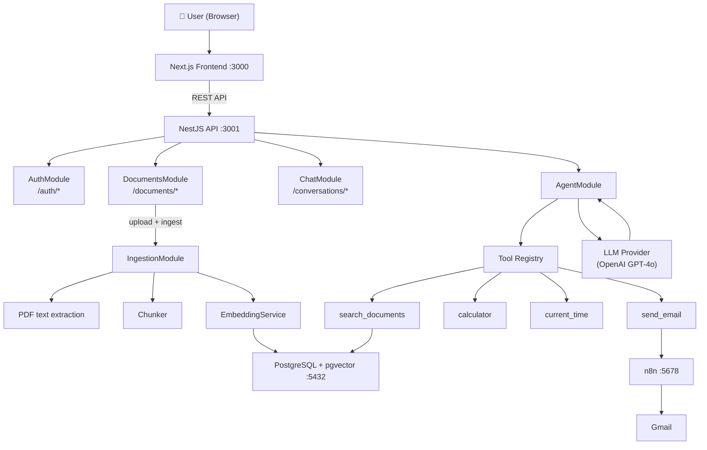

# Architecture

## System Overview



## Request Flow: RAG Chat

```
User asks: "What is the vacation policy?"
     │
     ▼
ChatModule  → create/update Conversation + Message
     │
     ▼
AgentModule → build tool definitions, call LLM
     │
     ▼
LLM decides → call tool: search_documents("vacation policy")
     │
     ▼
ToolsModule → EmbeddingService.embed(query)
           → pgvector cosine similarity search, top-5 chunks
           → return chunks + metadata
     │
     ▼
AgentModule → feed tool result back to LLM
     │
     ▼
LLM generates grounded answer + citations
     │
     ▼
Response saved → Message + AIRequestLog + ToolExecution
     │
     ▼
Frontend displays answer + source citations
```

## Request Flow: Email

```
User: "Email me a summary of the onboarding guide."
     │
     ▼
AgentModule:
  Step 1: search_documents("onboarding guide")
  Step 2: LLM summarizes retrieved chunks
  Step 3: send_email({ to, subject, body })
     │
     ▼
N8nModule → POST to n8n webhook
     │
     ▼
n8n workflow → Gmail → email sent
     │
     ▼
Agent reports success to user
```

## Database Schema

```
User
  id, email, passwordHash, createdAt, updatedAt
  │
  ├── Document[]
  │     id, userId, originalName, storedFilename,
  │     mimeType, fileSize, status, createdAt, updatedAt
  │       │
  │       └── DocumentChunk[]
  │             id, documentId, content, chunkIndex,
  │             pageNumber, metadata(JSON), embedding(vector)
  │
  ├── Conversation[]
  │     id, userId, title, createdAt, updatedAt
  │       │
  │       └── Message[]
  │             id, conversationId, role, content, createdAt
  │
  └── AIRequestLog[]
        id, userId, conversationId, prompt, retrievedChunks(JSON),
        selectedTool, response, model, latencyMs, createdAt

ToolExecution
  id, conversationId, messageId?, toolName, input(JSON),
  output(JSON), status, durationMs, createdAt
```

## Chunking Strategy

**Algorithm:** Paragraph-aware sliding window

1. Extract full text from PDF
2. Split on double-newline paragraph boundaries
3. Accumulate paragraphs into chunks of ~800 tokens (~3,200 chars)
4. When a chunk reaches the limit, save it and begin a new chunk
   with the last ~200 tokens (~800 chars) of the previous chunk (overlap)
5. Store chunkIndex (order in document) and approximate page number

**Why this approach:**
- Paragraph boundaries are natural semantic units
- Overlap preserves context at chunk edges (critical for RAG quality)
- 800 token chunks fit well within 8k context windows alongside system prompt

## Embedding Strategy

- Provider: OpenAI text-embedding-3-small
- Dimensions: 1536
- Stored in pgvector `vector(1536)` column
- Search: cosine similarity (`<=>` operator)
- Top-K: 5 chunks per query (configurable)
- Minimum similarity threshold: 0.3

## Agent Orchestration

Uses OpenAI's function/tool calling API:

1. Define tools with JSON Schema (name, description, parameters)
2. Send user message + recent history + tool definitions to LLM
3. LLM returns either a direct response OR a tool_call
4. If tool_call: execute the tool server-side, append result
5. Send result back to LLM for final answer generation
6. Repeat until LLM returns a non-tool response (max 5 iterations)

This is a **ReAct-style** loop without a separate planning step.
Simple, reliable, easy to debug, interview-friendly.

## Security

- Passwords: bcrypt (10 rounds)
- JWT: HS256, 7-day expiry, signed with env secret
- File uploads: type validation (PDF only), 20MB limit, stored outside web root
- User isolation: all queries scoped to authenticated userId
- Secrets: environment variables only, never in source
- Calculator: uses mathjs library (no eval)
- CORS: restricted to APP_URL origin
